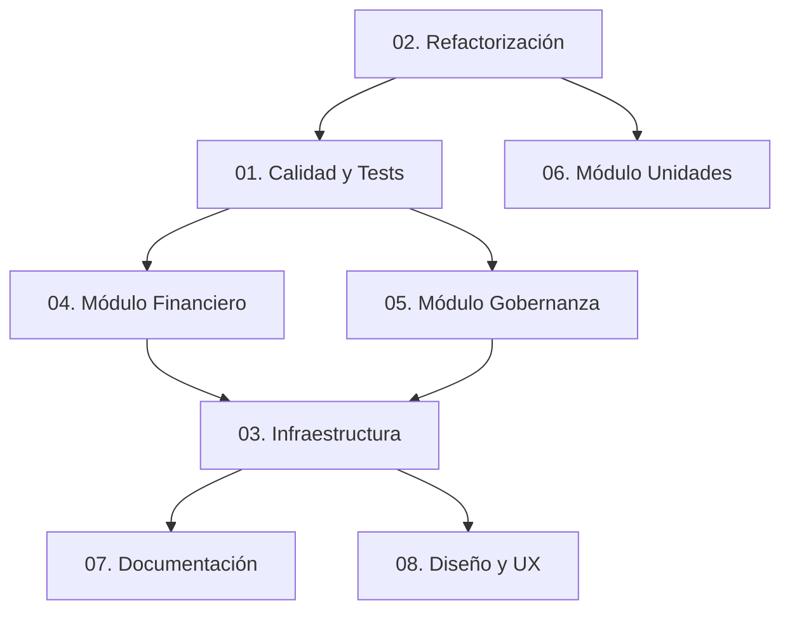

# 📁 PROYECTOS ORGANIZADOS - SISTEMA DE CONDOMINIOS

**Estructura:** Organización por módulos/proyectos funcionales  
**Fecha:** 2026-03-24  
**Total proyectos:** 8  
**Total tareas:** 17  

---

## 🏗️ **ESTRUCTURA DE PROYECTOS:**

```
proyectos_organizados/
├── README.md                          # Este archivo
├── 01_calidad_y_tests/                # Proyecto: Calidad y Testing
├── 02_refactorizacion/                # Proyecto: Refactorización de código
├── 03_infraestructura/                # Proyecto: Infraestructura y DevOps
├── 04_modulo_financiero/              # Proyecto: Módulo Financiero
├── 05_modulo_gobernanza/              # Proyecto: Módulo de Gobernanza
├── 06_modulo_unidades/                # Proyecto: Módulo de Unidades
├── 07_documentacion/                  # Proyecto: Documentación
└── 08_diseno_y_ux/                    # Proyecto: Diseño y UX
```

---

## 📊 **RESUMEN POR PROYECTO:**

| Proyecto | Tareas | Horas | Prioridad | Estado |
|----------|--------|-------|-----------|--------|
| **01. Calidad y Tests** | 2 | 14h | 🔴 Alta | 📝 Por hacer |
| **02. Refactorización** | 3 | 10h | 🔴 Alta | 📝 Por hacer |
| **03. Infraestructura** | 3 | 12h | 🟡 Media | 📝 Por hacer |
| **04. Módulo Financiero** | 1 | 8h | 🔴 Alta | 📝 Por hacer |
| **05. Módulo Gobernanza** | 1 | 6h | 🔴 Alta | 📝 Por hacer |
| **06. Módulo Unidades** | 1 | 4h | 🟡 Media | 📝 Por hacer |
| **07. Documentación** | 2 | 18h | 🟢 Baja | 📝 Por hacer |
| **08. Diseño y UX** | 2 | 26h | 🟢 Baja | 📝 Por hacer |
| **TOTAL** | **17** | **98h** | | |

---

## 🎯 **DETALLE POR PROYECTO:**

### **🏗️ 01. CALIDAD Y TESTS** (14 horas)
**Objetivo:** Establecer base sólida de testing y calidad
- TASK-002: Tests para módulo financiero (8h)
- TASK-003: Tests para módulo de votaciones (6h)

### **🔧 02. REFACTORIZACIÓN** (10 horas)
**Objetivo:** Limpiar y optimizar código base
- TASK-001: Eliminar código legacy auth (2h)
- TASK-004: Refactorizar modelo Expense (4h)
- TASK-005: Refactorizar modelo User (4h)

### **⚙️ 03. INFRAESTRUCTURA** (12 horas)
**Objetivo:** Mejorar infraestructura y DevOps
- TASK-006: Unificar archivos .env (2h)
- TASK-007: Implementar CI/CD básico (6h)
- TASK-010: Implementar cache Redis (4h)

### **💰 04. MÓDULO FINANCIERO** (8 horas)
**Objetivo:** Consolidar módulo financiero
- TASK-009: Optimizar queries N+1 (6h)
- TASK-008: Sistema de logging (2h) *[asociado]*

### **🏛️ 05. MÓDULO GOBERNANZA** (6 horas)
**Objetivo:** Fortalecer módulo de votaciones
- TASK-003: Tests para módulo de votaciones (6h) *[ya listado]*

### **🏢 06. MÓDULO UNIDADES** (4 horas)
**Objetivo:** Mejorar UX del módulo de unidades
- TASK-017: Nivel de piso editable en generación masiva (4h) *[NUEVA]*

### **📚 07. DOCUMENTACIÓN** (18 horas)
**Objetivo:** Crear documentación completa
- TASK-011: Documentación técnica unificada (8h)
- TASK-015: Guías de usuario completas (10h)

### **🎨 08. DISEÑO Y UX** (26 horas)
**Objetivo:** Mejorar experiencia de usuario
- TASK-012: Sistema de diseño unificado (12h)
- TASK-013: Optimizar base de datos (8h)
- TASK-014: Monitoreo de performance (6h)
- TASK-016: Métricas de calidad (4h) *[asociado]*

---

## 🚀 **RECOMENDACIÓN DE EJECUCIÓN:**

### **FASE 1: FUNDAMENTOS** (Semanas 1-2)
1. **Proyecto 02:** Refactorización (10h) - Limpiar base
2. **Proyecto 01:** Calidad y Tests (14h) - Establecer tests
3. **Proyecto 03:** Infraestructura (12h parcial) - .env + CI/CD

### **FASE 2: MÓDULOS CRÍTICOS** (Semanas 3-4)
4. **Proyecto 04:** Módulo Financiero (8h)
5. **Proyecto 05:** Módulo Gobernanza (6h)
6. **Proyecto 06:** Módulo Unidades (4h) *[NUEVA FEATURE]*

### **FASE 3: CONSOLIDACIÓN** (Mes 2)
7. **Proyecto 07:** Documentación (18h)
8. **Proyecto 08:** Diseño y UX (26h)
9. **Proyecto 03:** Infraestructura completa

---

## 🔗 **DEPENDENCIAS ENTRE PROYECTOS:**



---

## 📝 **CÓMO USAR ESTA ESTRUCTURA:**

1. **Trabajar por proyecto:** Enfocarse en un proyecto a la vez
2. **Priorizar por impacto:** Proyectos 01-03 primero (fundamentos)
3. **Seguir dependencias:** Respetar el orden del diagrama
4. **Documentar progreso:** En cada carpeta de proyecto

---

## 🆚 **COMPARACIÓN CON ESTRUCTURA ANTERIOR:**

| Aspecto | Estructura Anterior | Estructura Nueva |
|---------|-------------------|------------------|
| **Organización** | Por fases temporales | Por proyectos/módulos |
| **Enfoque** | Cronológico | Funcional |
| **Ventaja** | Timeline claro | Contexto por área |
| **Recomendado para** | Planificación temporal | Ejecución por equipos |

---

**Actualizado por:** Claw 🐾  
**Última actualización:** 2026-03-24