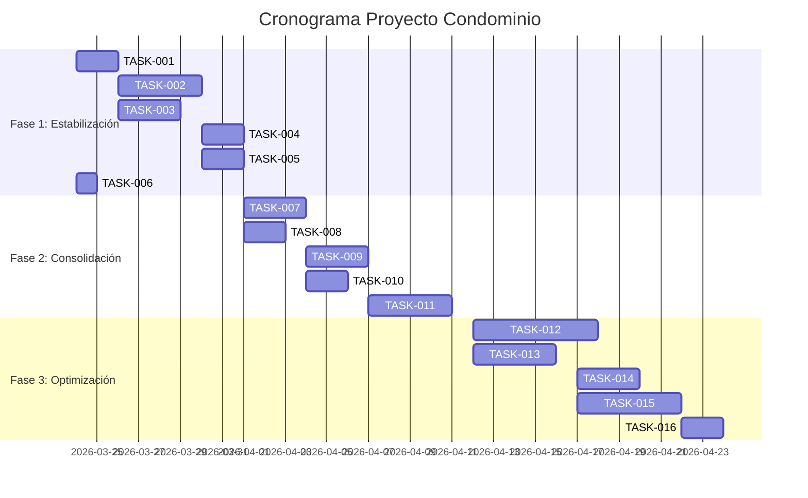

# 📋 SISTEMA DE TAREAS - PROYECTO CONDOMINIO

**Directorio:** `/root/.openclaw/workspace/tareas_proyecto/`  
**Estado:** 🟡 En progreso  
**Última actualización:** 2026-03-24

## 🗂️ ESTRUCTURA

```
tareas_proyecto/
├── README.md                    # Este archivo
├── fase_1_estabilizacion/       # Tareas de semana 1-2
├── fase_2_consolidacion/        # Tareas de semana 3-4  
├── fase_3_optimizacion/         # Tareas de mes 2
├── seguimiento/                 # Reportes y métricas
└── plantillas/                  # Plantillas para nuevas tareas
```

## 📊 ESTADO ACTUAL

| Fase | Total Tareas | Completadas | En Progreso | Pendientes |
|------|--------------|-------------|-------------|------------|
| **Fase 1** | 6 | 0 | 0 | 6 |
| **Fase 2** | 5 | 0 | 0 | 5 |
| **Fase 3** | 5 | 0 | 0 | 5 |
| **🆕 Nueva Feature** | **1** | **0** | **0** | **1** |
| **TOTAL** | **17** | **0** | **0** | **17** |

## 🚀 PRÓXIMOS PASOS

1. **Hoy:** Comenzar con TASK-001 (Eliminar código legacy)
2. **Esta semana:** Completar Fase 1 (26 horas estimadas)
3. **Siguiente semana:** Revisar progreso y ajustar plan

## 📅 CRONOGRAMA



## 🔗 ENLACES ÚTILES

- [Resumen del análisis](../informe_analisis_profundo.md)
- [Plan detallado](../tareas_proyecto_condominio.md)
- [Proyecto Laravel](/home/torreclick/condominio-management)

## 👥 RESPONSABLES

| Rol | Responsable | Contacto |
|-----|-------------|----------|
| **Project Lead** | rangerdev | Telegram: @rangerdevvnz |
| **QA/Testing** | Claw 🐾 | OpenClaw Assistant |
| **Documentación** | Claw 🐾 | OpenClaw Assistant |

## 📝 CÓMO USAR ESTE SISTEMA

1. **Para comenzar una tarea:** Ve a la carpeta correspondiente
2. **Para actualizar estado:** Edita el archivo `.md` de la tarea
3. **Para reportar progreso:** Usa los archivos en `seguimiento/`
4. **Para agregar nuevas tareas:** Usa las plantillas en `plantillas/`

---

**Actualizado automáticamente por:** Claw 🐾  
**Próxima revisión:** 2026-03-27 (cada 3 días)