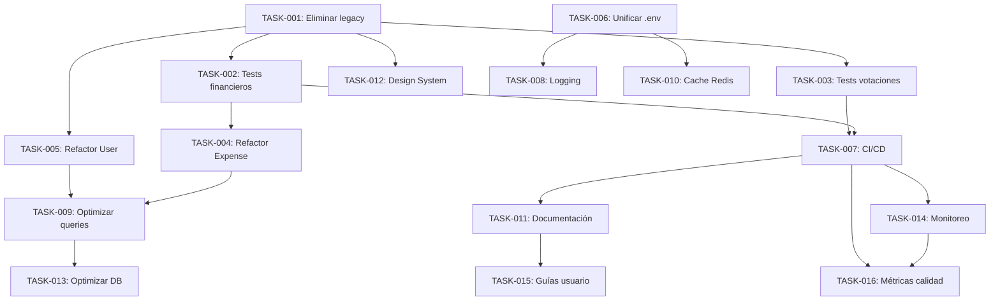

# 📋 PROYECTO DE CONDOMINIO - PLAN DE TRABAJO

**Fecha:** 2026-03-24  
**Estado:** 📝 Planificación  
**Prioridad:** 🔴 Alta  
**Estimación total:** 94 horas (~2.5 meses)

---

## 🏗️ **FASE 1: ESTABILIZACIÓN** (Semana 1-2 | 26 horas)

### **🔴 PRIORIDAD ALTA - CRÍTICO**

#### **1. Eliminar código legacy auth components** (2 horas)
- **ID:** TASK-001
- **Tipo:** 🔧 Refactor
- **Estado:** 📝 Por hacer
- **Dependencias:** Ninguna
- **Subtareas:**
  - [ ] Eliminar `resources/js/Pages/Auth/*Old.vue`
  - [ ] Actualizar rutas en `routes/auth.php`
  - [ ] Verificar que login/register funcionen
  - [ ] Actualizar referencias en otros componentes

#### **2. Crear tests para módulo financiero** (8 horas)
- **ID:** TASK-002
- **Tipo:** 🧪 Test
- **Estado:** 📝 Por hacer
- **Dependencias:** TASK-001
- **Subtareas:**
  - [ ] Crear `tests/Feature/Financial/ReceivableTest.php`
  - [ ] Crear `tests/Feature/Financial/ExpenseTest.php`
  - [ ] Crear `tests/Feature/Financial/CashTransactionTest.php`
  - [ ] Tests de integración para flujos de pago
  - [ ] Tests de seguridad para transacciones
  - [ ] Alcanzar 80%+ cobertura en módulo financiero

#### **3. Crear tests para módulo de votaciones** (6 horas)
- **ID:** TASK-003
- **Tipo:** 🧪 Test
- **Estado:** 📝 Por hacer
- **Dependencias:** TASK-001
- **Subtareas:**
  - [ ] Crear `tests/Feature/Governance/VotingTest.php`
  - [ ] Crear `tests/Feature/Governance/GovernanceVoteTest.php`
  - [ ] Crear `tests/Feature/Governance/VotingAuditLogTest.php`
  - [ ] Tests de integridad de votaciones
  - [ ] Tests de generación de actas PDF
  - [ ] Tests de verificación QR de actas

#### **4. Refactorizar modelo Expense (309 líneas)** (4 horas)
- **ID:** TASK-004
- **Tipo:** 🔧 Refactor
- **Estado:** 📝 Por hacer
- **Dependencias:** TASK-002
- **Subtareas:**
  - [ ] Crear `app/Services/ExpenseService.php`
  - [ ] Crear `app/Repositories/ExpenseRepository.php`
  - [ ] Extraer lógica de negocio del modelo
  - [ ] Reducir `app/Models/Expense.php` a <150 líneas
  - [ ] Actualizar controladores para usar Service/Repository

#### **5. Refactorizar modelo User (266 líneas)** (4 horas)
- **ID:** TASK-005
- **Tipo:** 🔧 Refactor
- **Estado:** 📝 Por hacer
- **Dependencias:** TASK-001
- **Subtareas:**
  - [ ] Crear `app/Services/UserService.php`
  - [ ] Crear `app/Repositories/UserRepository.php`
  - [ ] Extraer lógica de autenticación y roles
  - [ ] Reducir `app/Models/User.php` a <150 líneas
  - [ ] Actualizar controladores para usar Service/Repository

#### **6. Unificar archivos .env** (2 horas)
- **ID:** TASK-006
- **Tipo:** 🔧 Refactor
- **Estado:** 📝 Por hacer
- **Dependencias:** Ninguna
- **Subtareas:**
  - [ ] Consolidar `.env`, `.env.docker`, `.env.local`, `.env.production`
  - [ ] Crear `.env.example` completo con todas las variables
  - [ ] Documentar variables críticas en `ENV_VARIABLES.md`
  - [ ] Actualizar `docker-compose.yml` para usar variables unificadas

---

## ⚙️ **FASE 2: CONSOLIDACIÓN** (Semana 3-4 | 28 horas)

### **🟡 PRIORIDAD MEDIA - IMPORTANTE**

#### **7. Implementar CI/CD básico con GitHub Actions** (6 horas)
- **ID:** TASK-007
- **Tipo:** 🔧 Refactor
- **Estado:** 📝 Por hacer
- **Dependencias:** TASK-002, TASK-003
- **Subtareas:**
  - [ ] Crear `.github/workflows/tests.yml`
  - [ ] Configurar pipeline para tests automáticos
  - [ ] Crear `.github/workflows/deploy.yml`
  - [ ] Configurar deployment a staging/production
  - [ ] Configurar notificaciones de status (Telegram/Email)
  - [ ] Documentar proceso en `CI_CD_GUIDE.md`

#### **8. Crear sistema de logging estructurado** (4 horas)
- **ID:** TASK-008
- **Tipo:** 🔧 Refactor
- **Estado:** 📝 Por hacer
- **Dependencias:** TASK-006
- **Subtareas:**
  - [ ] Configurar Monolog en `config/logging.php`
  - [ ] Crear canales para diferentes módulos (financial, governance, auth)
  - [ ] Implementar rotación diaria de logs
  - [ ] Configurar retención de 30 días
  - [ ] Crear `app/Logging/FinancialLogger.php`
  - [ ] Documentar en `LOGGING_GUIDE.md`

#### **9. Optimizar queries N+1 en módulos críticos** (6 horas)
- **ID:** TASK-009
- **Tipo:** 🔧 Refactor
- **Estado:** 📝 Por hacer
- **Dependencias:** TASK-004, TASK-005
- **Subtareas:**
  - [ ] Identificar queries problemáticas con Laravel Debugbar
  - [ ] Implementar eager loading en relaciones comunes
  - [ ] Agregar indexes estratégicos en migraciones
  - [ ] Crear `app/Observers/QueryOptimizer.php`
  - [ ] Documentar optimizaciones en `PERFORMANCE_OPTIMIZATION.md`
  - [ ] Medir mejora de performance

#### **10. Implementar cache Redis consistente** (4 horas)
- **ID:** TASK-010
- **Tipo:** 🔧 Refactor
- **Estado:** 📝 Por hacer
- **Dependencias:** TASK-006
- **Subtareas:**
  - [ ] Configurar cache Redis en `config/cache.php`
  - [ ] Implementar cache para datos frecuentes (condominios, usuarios)
  - [ ] Implementar cache para reportes pesados
  - [ ] Crear estrategias de invalidación (TTL, tags)
  - [ ] Crear `app/Services/CacheService.php`
  - [ ] Documentar en `CACHING_STRATEGY.md`

#### **11. Crear documentación técnica unificada** (8 horas)
- **ID:** TASK-011
- **Tipo:** 📚 Documentación
- **Estado:** 📝 Por hacer
- **Dependencias:** TASK-007
- **Subtareas:**
  - [ ] Actualizar `README.md` completo
  - [ ] Crear `INSTALLATION_GUIDE.md` detallado
  - [ ] Crear `DEVELOPMENT_GUIDE.md` con convenciones
  - [ ] Crear `API_DOCUMENTATION.md` con ejemplos
  - [ ] Crear `ARCHITECTURE_OVERVIEW.md`
  - [ ] Crear `TROUBLESHOOTING.md` con problemas comunes

---

## 📈 **FASE 3: OPTIMIZACIÓN** (Mes 2 | 40 horas)

### **🟢 PRIORIDAD BAJA - MEJORA**

#### **12. Crear sistema de diseño unificado (Design System)** (12 horas)
- **ID:** TASK-012
- **Tipo:** ✨ Feature
- **Estado:** 📝 Por hacer
- **Dependencias:** TASK-001
- **Subtareas:**
  - [ ] Crear `resources/js/DesignSystem/` con componentes base
  - [ ] Definir design tokens (colores, tipografía, spacing)
  - [ ] Crear `DESIGN_SYSTEM_GUIDE.md`
  - [ ] Implementar componentes: Button, Input, Card, Modal
  - [ ] Actualizar componentes existentes para usar Design System
  - [ ] Crear storybook o documentación de componentes

#### **13. Optimizar base de datos (indexes, particiones)** (8 horas)
- **ID:** TASK-013
- **Tipo:** 🔧 Refactor
- **Estado:** 📝 Por hacer
- **Dependencias:** TASK-009
- **Subtareas:**
  - [ ] Analizar performance de queries con EXPLAIN
  - [ ] Agregar indexes estratégicos en migraciones
  - [ ] Considerar particionamiento para tablas grandes
  - [ ] Optimizar queries complejas con subqueries/CTEs
  - [ ] Crear `DATABASE_OPTIMIZATION.md`
  - [ ] Configurar backups automatizados

#### **14. Implementar monitoreo de performance** (6 horas)
- **ID:** TASK-014
- **Tipo:** 🔧 Refactor
- **Estado:** 📝 Por hacer
- **Dependencias:** TASK-007
- **Subtareas:**
  - [ ] Instalar y configurar Laravel Telescope
  - [ ] Configurar application performance monitoring
  - [ ] Crear dashboards para métricas clave
  - [ ] Configurar alertas para degradación de performance
  - [ ] Documentar en `MONITORING_SETUP.md`
  - [ ] Configurar log aggregation (ELK/Sentry opcional)

#### **15. Crear guías de usuario completas** (10 horas)
- **ID:** TASK-015
- **Tipo:** 📚 Documentación
- **Estado:** 📝 Por hacer
- **Dependencias:** TASK-011
- **Subtareas:**
  - [ ] Crear `USER_GUIDE_ADMIN.md` para administradores
  - [ ] Crear `USER_GUIDE_RESIDENT.md` para residentes
  - [ ] Crear video tutorials (3-5 minutos cada uno)
  - [ ] Crear screenshots y GIFs para documentación
  - [ ] Traducir guías a inglés/español
  - [ ] Publicar en `/docs` del proyecto

#### **16. Establecer métricas de calidad continuas** (4 horas)
- **ID:** TASK-016
- **Tipo:** 🔧 Refactor
- **Estado:** 📝 Por hacer
- **Dependencias:** TASK-007, TASK-014
- **Subtareas:**
  - [ ] Configurar code coverage tracking
  - [ ] Establecer métricas de calidad (complexity, duplication)
  - [ ] Configurar performance benchmarks
  - [ ] Crear dashboard de métricas
  - [ ] Establecer thresholds mínimos
  - [ ] Documentar en `QUALITY_METRICS.md`

---

## 📊 **RESUMEN DE DEPENDENCIAS**

---

## 🗓️ **CRONOGRAMA ESTIMADO**

| Semana | Fase | Tareas | Horas | Estado |
|--------|------|--------|-------|--------|
| **1** | Estabilización | 1, 6 | 4 | 📅 Planificado |
| **2** | Estabilización | 2, 3, 4, 5 | 22 | 📅 Planificado |
| **3** | Consolidación | 7, 8 | 10 | 📅 Planificado |
| **4** | Consolidación | 9, 10, 11 | 18 | 📅 Planificado |
| **5-6** | Optimización | 12, 13 | 20 | 📅 Planificado |
| **7-8** | Optimización | 14, 15, 16 | 20 | 📅 Planificado |

**Total:** 8 semanas (2 meses) | 94 horas

---

## 🎯 **CRITERIOS DE ÉXITO**

### **Fase 1 (Estabilización):**
- ✅ 0 componentes legacy auth
- ✅ 80%+ cobertura tests en módulos críticos
- ✅ Modelos <150 líneas
- ✅ .env unificado y documentado

### **Fase 2 (Consolidación):**
- ✅ CI/CD funcionando con tests automáticos
- ✅ Logging estructurado implementado
- ✅ Queries N+1 eliminadas
- ✅ Cache Redis funcionando
- ✅ Documentación técnica completa

### **Fase 3 (Optimización):**
- ✅ Design System implementado
- ✅ Base de datos optimizada
- ✅ Monitoreo de performance activo
- ✅ Guías de usuario publicadas
- ✅ Métricas de calidad establecidas

---

**Última actualización:** 2026-03-24  
**Responsable:** rangerdev  
**Seguimiento:** Revisión semanal los viernes 10:00 AM